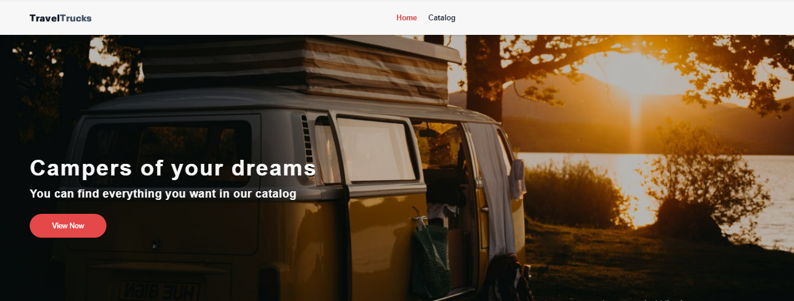
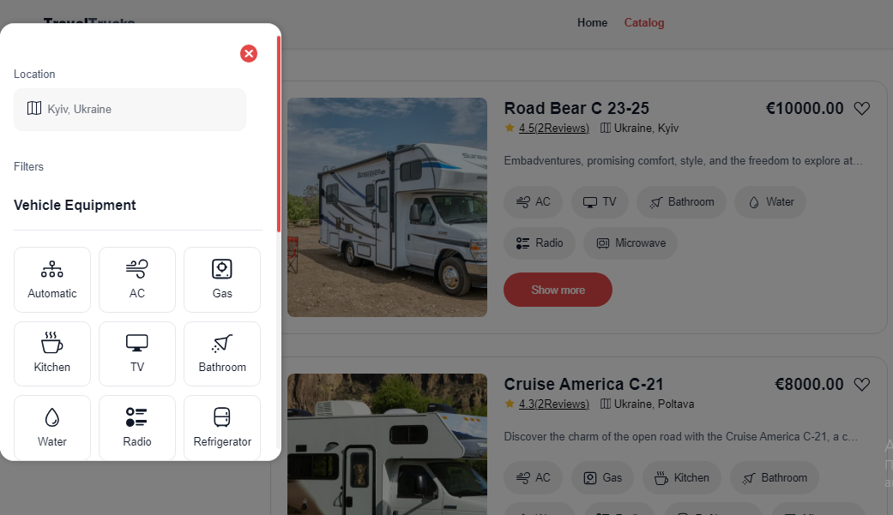

# TravelTrucks

# Project Description

🏅 _TravelTrucks_ is the frontend part of a web application for a company specializing in camper rentals. The application allows users to browse a catalog of available campers, filter them by various parameters, view details of selected campers, leave reviews, and book transport.

The project is developed according to the technical specification, with additional improvements and changes.

# 🚀 Features

- 📌 **Home Page** – general information about the service.
- 🚐 **Camper Catalog** – browse available vehicles.
- 🔍 **Filtering** – search campers by location, features, and transport type in a modal window.
- 💖 **Favorites** – ability to add campers to a favorites list (saved in localStorage).
- 🔺 **Scroll Up** – quick and convenient return to the filter selection.
- 📄 **Camper Details Page** – detailed information about each vehicle, with a "Show More" button.
- ⚙ **Load More Cards** – with the "Load More" button.
- ✨ **User Reviews** – with a five-star rating system.
- 📅 **Booking Form** – the ability to submit a booking request.

# 🛠️ Technologies

- **React + Vite** – fast development and efficient rendering of components.
- **Redux Toolkit** – state management.
- **React Router** – routing.
- **TailwindCSS** – fast and efficient styling.
- **Axios – API** requests.
- **Vercel** – deployment.

# Main Pages

- **Home** (/) – contains a banner and the main call-to-action.
- **Camper Catalog** (/catalog) – a list of campers with filtering options and the ability to add to favorites.
- **Single Camper Page** (/catalog/:id) – detailed information, gallery, reviews, and booking form.

# API

Data is fetched from the backend: MockAPI

- Main endpoints:

- **GET /campers** – fetch list of campers

- **GET /campers/:id** – fetch details of a specific camper

## 📦 Installation and Running

```sh
Clone the repository

git clone https://travel-trucks-chi-eight.vercel.app/
cd traveltrucks

Install dependencies

npm install

Run in development mode

npm run dev

Deploy on Vercel/Netlify
```

# Design

The project is implemented according to the design mockups. The main focus is on the desktop version, with responsiveness for mobile formats.

# 📸 Screenshots


# 💡 Future Improvements

- 🔹 User authentication and profiles.
- 🔹 Advanced filtering for camper search.
- 🔹 Transition the application to TypeScript.

# 📄 License

# Contacts

[GitHub Profile](https://github.com/nykyforuk-vasyl)

If you have any questions or suggestions, feel free to reach out through GitHub! 🚀

##--------------------------------------------------------------------------------------------##

# TravelTrucks

# Опис проєкту

🏅*TravelTrucks* – це фронтенд-частина веб-додатку для компанії, що займається орендою кемперів. Додаток дозволяє користувачам переглядати каталог доступних кемперів, фільтрувати їх за різними параметрами, переглядати деталі обраного кемпера, залишати відгуки та бронювати транспорт.

Проєкт розроблений відповідно до технічного завдання, із додатковими покращеннями та змінами.

## 🚀 Функціонал

- 📌 **Головна сторінка** - загальна інформація про сервіс.
- 🚐 **Каталог кемперів** - перегляд доступних транспортних засобів.
- 🔍 **Фільтрація** - пошук кемперів за локацією, характеристиками та типом транспорту, в модальному вікні.
- 💖 **Обране** - можливість додавати кемпери в список улюблених (збереження в localStorage).
- 🔺 **Скрол вверх** - для швидкого та зручного повернення до вибору фільтрів.
- 📄 **Сторінка деталей кемпера** - детальна інформація про кожен транспортний засіб, через кнопку "Show More".
- ⚙ **Довантаження карток** - кнопкою "Load More".
- ✨ **Відгуки користувачів** - із п'ятизірковою шкалою.
- 📅 **Форма бронювання** - можливість залишити заявку на бронювання кемпера.

## 🛠️ Технології

- **React + Vite** - швидка розробка та ефективний рендеринг компонентів.
- **Redux Toolkit** - керування станом.
- **React Router** - маршрутизація.
- **TailvindCSS** - швидка та ефективна робота з стилями.
- **Axios** - запити до API.
- **Vercel** - деплоймент.

## Основні сторінки

- **Головна** (/) – містить банер та основний заклик до дії.

- **Каталог кемперів** (/catalog) – список кемперів з можливістю фільтрації та додавання в обране.

- **Сторінка окремого кемпера** (/catalog/:id) – детальна інформація, галерея, відгуки та форма бронювання.

## API

- Дані отримуються з бекенду: MockAPI

- Основні ендпоінти:

- **GET /campers** – отримання списку кемперів

- **GET /campers/:id** – отримання деталей конкретного кемпера

## 📦 Встановлення та запуск

```sh

# Клонування репозиторію
git clone https://travel-trucks-chi-eight.vercel.app/
cd traveltrucks

# Встановлення залежностей
npm install

# Запуск у режимі розробки
npm run dev

Деплой на Vercel/Netlify
```

## Дизайн

Проєкт реалізований відповідно до макету. Основний фокус – десктопна версія, адаптивність – для мобільного формату.

## 📸 Скриншоти




## 💡 Подальші покращення

- 🔹 Авторизація та профілі користувачів.
- 🔹 Розширені фільтри для пошуку кемперів.
- 🔹 Перехід застосунку на технологію TypeSkript

## 📄 Ліцензія

## Контакти

https://github.com/nykyforuk-vasyl

Якщо у вас є питання або пропозиції, зв'яжіться зі мною через GitHub! 🚀

---
